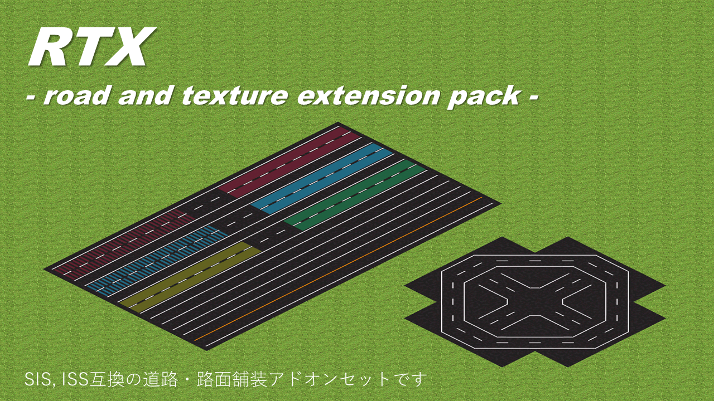
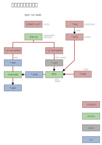

# road and texture extension pack

SIS, ISS互換の道路と路面舗装アドオンセットです。

# 導入

リリースページからダウンロードしてください。
https://github.com/128na/rtx/releases

# 開発者向け

事前にpython(3.12以上)を導入してください。

```
git clone --recursive https://github.com/128na/rtx.git

npm run setup
```

- [simutrans-image-merger.exe](https://github.com/128na/simutrans-image-merger/releases/tag/latest)をダウンロードしてこのディレクトリに設置
- pak化用のmakeobjをダウンロードして設置
- 動作確認用のsimutransをダウンロードして設置

```
┗simutrans
    ┗simutrans.exe
    ┗pak128
┗makeobj.exe
┗simutrans-image-merger.exe
```

```
npm run dev
```

## info




### dat生成
jinjaテンプレート(.j2)を使用しています。

### 画像生成
テクスチャからタイル画像生成を [Road Tile Generator](https://github.com/128na/rtg)、タイル切り出しには [
simutrans-image-marger](https://github.com/128na/simutrans-image-merger) を使用しています。
